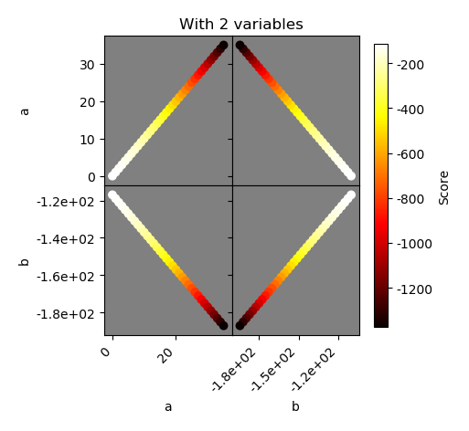
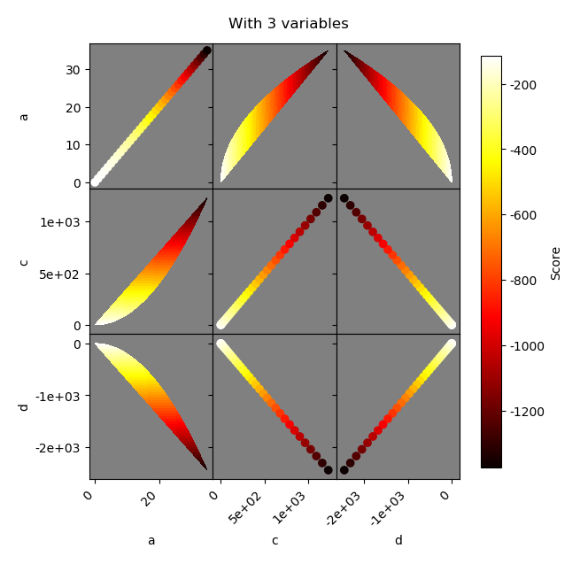
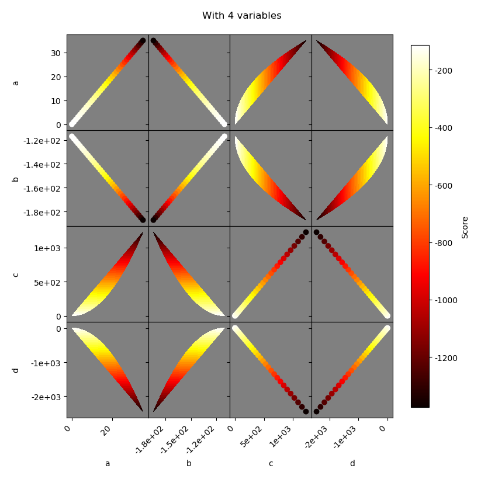
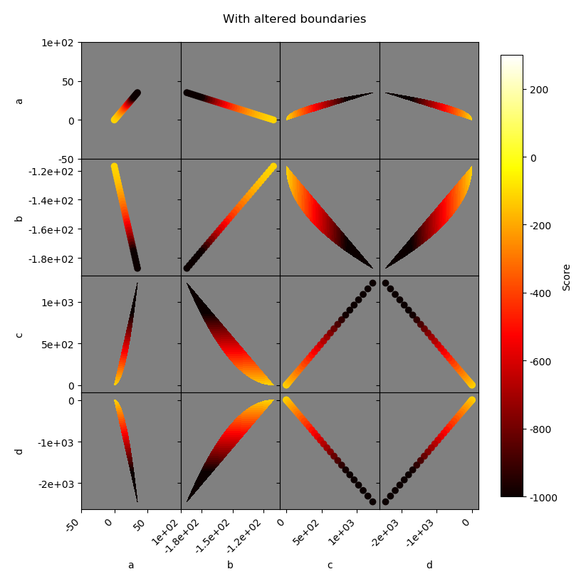
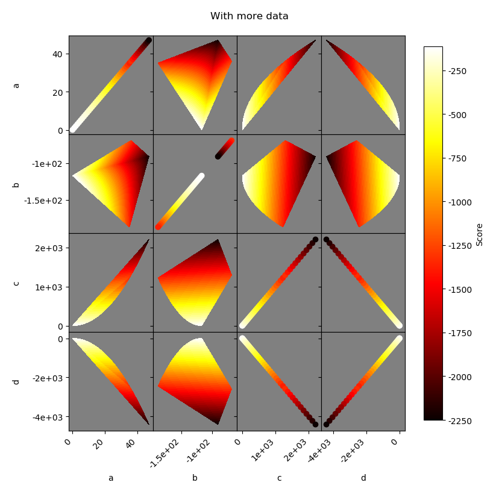

# hyperparameter_search_plotting
Some quick code for plotting the results of a hyperparameter search

# Usage

License is MIT. Feel free to use and modify as you feel suit! The format for the
inputs is designed to exactly match the output from [sklearn `GridSearchCV`](https://scikit-learn.org/stable/modules/generated/sklearn.model_selection.GridSearchCV.html)

If you have a `GridSearchCV` already, then you can run the code minimally with:

```python
gridsearch = ...
parameters = gridsearch.cv_results_["params"]
scores = gridsearch.cv_results_["mean_test_score"]

fig = plot_hyperparameter_results(all_params, all_scores)
save_figure(fig, "filename.png")
```

# Examples

Some example plots. Notice that rather than trying to view a higher-dimensional space directly, we are instead viewing aggregates (the maximum value) across all dimensions except for two.







You can also change the bounds of the region where parameters are plotted independly for each parameter and also change the bounds of the colorbar.



Since the only inputs are lists of the parameters tested and the scores, you can simply concatenate results from different runs together and get new plots.

